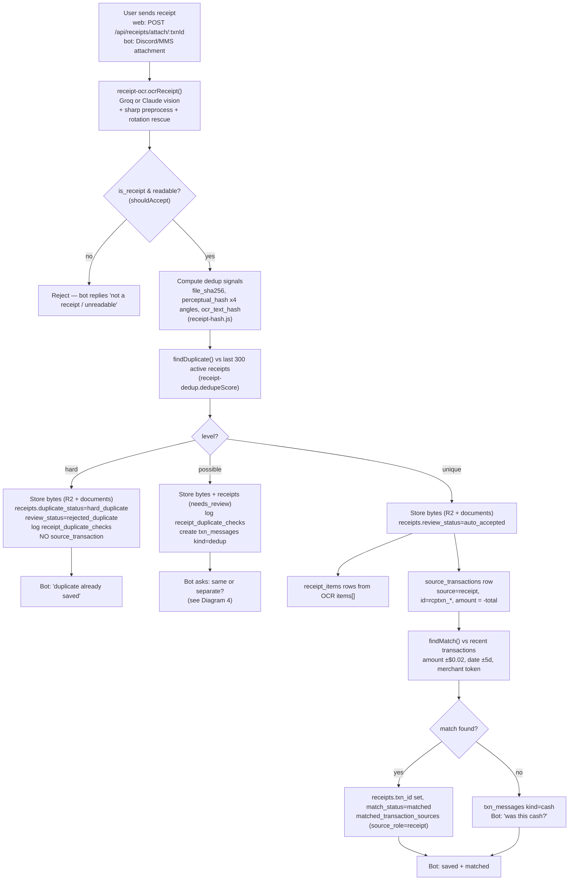
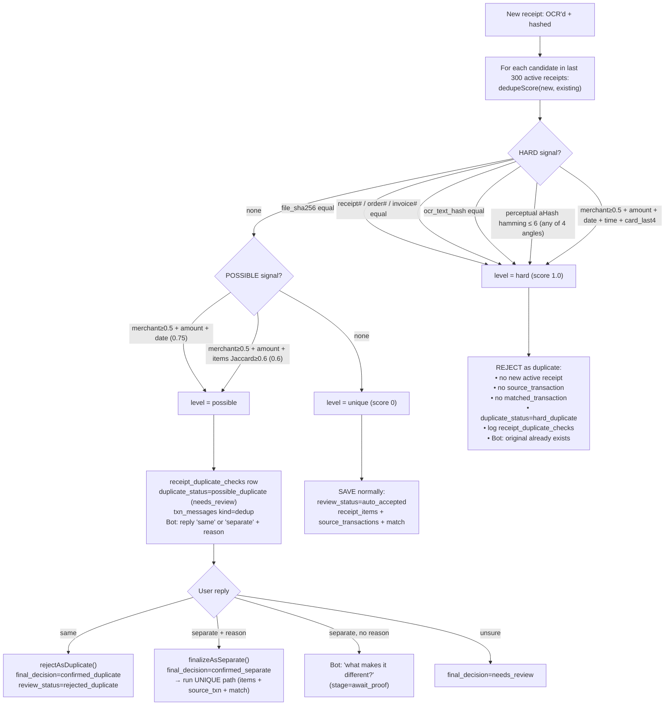
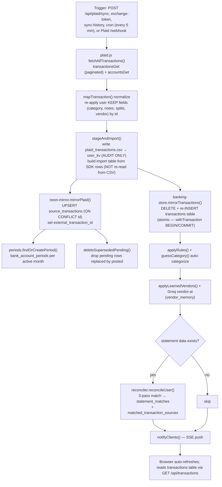
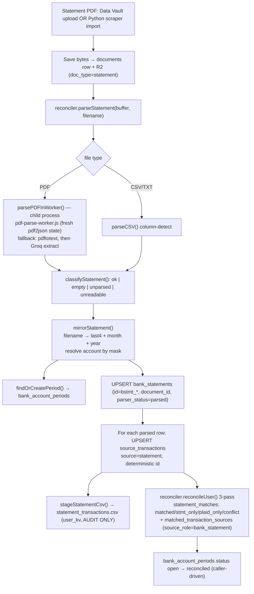
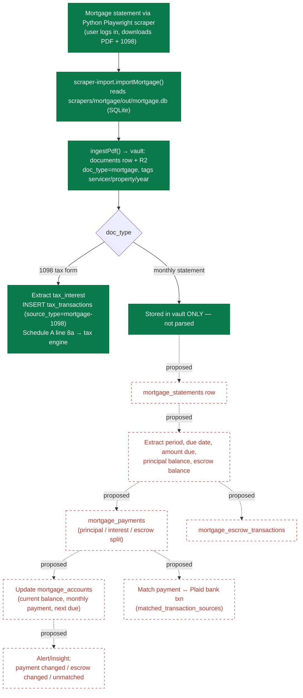
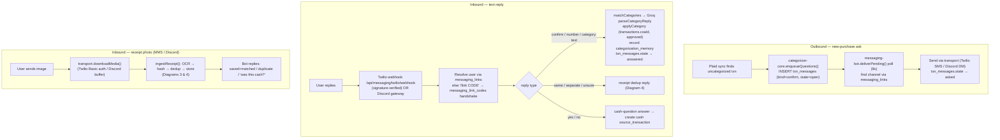
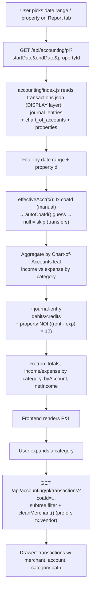

# CaiShen Backend Map

> Generated from a code inspection of `server/` on the `refactor/folder-per-page` branch.
> Diagrams are **diagram-as-code** (Mermaid + DBML) — paste Mermaid into
> <https://mermaid.live> and DBML into <https://dbdiagram.io> to render/edit.

## TL;DR — what already exists vs. what you listed

Your "recommended remodel" is **mostly already built**. The DB is the source of truth;
CSV files are write-only audit snapshots, never read back into the pipeline.

| Your roadmap name | Actual table in code | Status |
|---|---|---|
| `users` | `users` | ✅ exists |
| `bank_accounts` | `accounts` (generalized, `account_class` discriminator) | ✅ exists |
| `bank_account_periods` | `bank_account_periods` | ✅ exists |
| `files` | `documents` (bytes in Cloudflare R2) | ✅ exists |
| `bank_statements` | `bank_statements` | ✅ exists |
| `receipts` | `receipts` | ✅ exists |
| `receipt_items` | `receipt_items` | ✅ exists |
| `source_transactions` | `source_transactions` | ✅ exists (universal intake) |
| `matched_transactions` | `transactions` (the display layer) | ✅ exists, different name |
| `matched_transaction_sources` | `matched_transaction_sources` | ✅ exists |
| `receipt_duplicate_checks` | `receipt_duplicate_checks` | ✅ exists |
| `mortgage_accounts` | `accounts WHERE account_class='loan'` | ⚠️ no dedicated table |
| `mortgage_statements` | `documents WHERE doc_type='mortgage'` | ⚠️ not parsed |
| `mortgage_payments` | (only Plaid transactions) | ❌ missing |
| `mortgage_escrow_transactions` | — | ❌ missing |
| `mortgage_documents` | folded into `documents` | ⚠️ |

**The one real schema gap is the mortgage domain.** Everything else exists; the work
left is *consolidation and wiring*, not green-field building.

---

## 1. Overall Backend Architecture

```mermaid
flowchart TD
  %% ---------- Clients ----------
  subgraph clients["Clients"]
    Web["React SPA (Vite :5173 / served from :3001)"]
    Phone["User phone (SMS / MMS)"]
    DiscordDM["User Discord DM"]
  end

  %% ---------- External services ----------
  subgraph ext["External services"]
    Plaid["Plaid API"]
    Twilio["Twilio SMS/MMS"]
    DiscordGW["Discord Gateway"]
    Groq["Groq (LLM + vision)"]
    Anthropic["Anthropic Claude"]
    Chain["Blockchain APIs (BTC/ETH/SOL...)"]
    PyScraper["Python Playwright scrapers (Chase/BoA/Rocket)"]
  end

  %% ---------- API layer ----------
  subgraph api["Express API — server/index.js (:3001)"]
    AuthR["/api/auth — JWT + 2FA (core/auth.js)"]
    BankR["/api — banking/routes.js"]
    PlaidR["/api/plaid — banking/plaid.js"]
    ReconR["/api/reconcile — banking/reconcile-routes.js"]
    RcptR["/api/receipts — banking/receipt-routes.js"]
    MsgR["/api/messaging (+ Twilio webhook) — messaging-routes / messaging-bot"]
    AcctR["/api/accounting — accounting/index.js (P&L)"]
    VaultR["/api/vault — vault.js"]
    TaxR["/api/tax-* — tax/*"]
    CryptoR["/api/crypto — crypto/*"]
    AdvR["/api/advisor — advisor/index.js"]
    SSE["/api/events — SSE push"]
  end

  %% ---------- Services / engines ----------
  subgraph svc["Services / engines"]
    PlaidSvc["plaid.js — fetch + stageAndImport"]
    Mirror["neon-mirror.js — source_transactions upsert"]
    BankStore["core/banking-store.js — transactions full-replace"]
    Periods["periods.js — bank_account_periods"]
    Reconciler["reconciler.js — 3-pass matching"]
    RcptOCR["receipt-ocr.js — vision OCR + rotation rescue"]
    Dedup["receipt-dedup.js — hashes + score"]
    Bot["messaging-bot.js + categorizer-core.js"]
    Vendor["vendor-learn.js / vendor-ai.js"]
    Categorize["categorize.js / auto-categorize.js"]
    Reports["accounting/index.js — P&L builder"]
  end

  %% ---------- Data layer ----------
  subgraph data["Data layer"]
    Neon["Neon PostgreSQL (all structured tables)"]
    R2["Cloudflare R2 (file bytes)"]
    KV["user_kv (JSON/CSV blobs, audit)"]
  end

  Web -->|HTTPS + JWT| AuthR
  Web --> BankR
  Web --> PlaidR
  Web --> ReconR
  Web --> RcptR
  Web --> AcctR
  Web --> VaultR
  Web --> TaxR
  Web --> CryptoR
  Web --> AdvR
  Web -.->|EventSource| SSE
  Phone -->|inbound webhook| MsgR
  DiscordGW --> Bot
  DiscordDM --> DiscordGW

  PlaidR --> PlaidSvc
  Plaid --> PlaidSvc
  PlaidSvc --> Mirror
  PlaidSvc --> BankStore
  PlaidSvc --> Periods
  PlaidSvc --> Vendor
  PlaidSvc --> Categorize
  PlaidSvc --> Reconciler
  Vendor --> Groq
  ReconR --> Reconciler
  Mirror --> Neon
  BankStore --> Neon
  Periods --> Neon
  Reconciler --> Neon

  RcptR --> RcptOCR
  RcptOCR --> Groq
  RcptOCR --> Anthropic
  RcptR --> Dedup
  Dedup --> Neon
  RcptOCR --> R2

  MsgR --> Bot
  Bot --> Twilio
  Bot --> DiscordGW
  Bot --> RcptOCR
  Bot --> Neon

  AcctR --> Reports
  Reports --> Neon
  VaultR --> R2
  VaultR --> Neon
  PyScraper --> VaultR
  AdvR --> Anthropic
  CryptoR --> Chain
  PlaidSvc --> KV
  BankStore --> KV
```



**What it shows.** Every client → router → service → datastore path. The API is one
Express process (`server/index.js`, ~850 lines) that mounts ~30 routers; each module
gets per-user DB access through the `makeIO(userId)` factory. **Source of truth =
Neon Postgres** for structured data, **R2** for file bytes, `user_kv` for long-tail
JSON/CSV (audit + a few unstructured docs).
**Still to do:** extract the many *inline* routes still living in `index.js`
(properties, tax-years, import-history, crypto txns, wallets, backup/restore,
parse-statement) into their own modules.

---

## 2. Database Schema (DBML)

```dbml
// ============================================================================
//  CaiShen — banking / transaction / receipt / statement schema
//  Paste into https://dbdiagram.io
//  NOTE: `transactions` is FULL-REPLACED (DELETE+INSERT) on every Plaid sync,
//        so links to it (transaction_id, plaid_txn_id, receipts.txn_id) are
//        intentionally PLAIN TEXT, NOT hard FKs — a cascade would wipe them
//        every sync. They are drawn as relationships here for readability.
// ============================================================================

Table users {
  id              text [pk]
  username        text [not null, unique]
  email           text [unique]
  password_hash   text [not null]
  role            text [not null, note: 'admin|editor|viewer']
  phone           text
  trusted_devices text [note: 'jsonb']
  created_at      timestamptz
}

Table plaid_items {
  id               text [pk]
  user_id          text [not null]
  item_id          text [not null, unique]
  access_token_enc text [not null, note: 'bytea — AES-256-GCM ciphertext']
  institution_id   text
  institution_name text
  status           text [note: 'active|login_required|revoked']
  last_sync_at     timestamptz
}

Table accounts {
  id                text [pk, note: 'Plaid account_id or generated']
  user_id           text [not null]
  plaid_item_id     text
  source            text [not null, note: 'plaid|manual|crypto']
  account_class     text [not null, note: 'bank|card|loan|investment|crypto|property']
  plaid_subtype     text [note: 'checking|savings|mortgage|401k...']
  name              text
  mask              text [note: 'last 4 only']
  current_balance   decimal
  available_balance decimal
  details           text [note: 'jsonb — type-specific long tail']
}

Table documents {
  id             text [pk]
  user_id        text [not null]
  account_id     text
  doc_type       text [not null, note: 'statement|tax_form|mortgage|receipt|other']
  storage_key    text [not null, note: 'R2 object key']
  storage_bucket text [not null]
  sha256         text [note: 're-upload dedup']
  period_year    integer
  period_month   integer
  tags           text [note: 'jsonb']
  ocr_data       text [note: 'jsonb']
}

Table bank_account_periods {
  id              text [pk]
  user_id         text [not null]
  account_id      text
  start_date      date
  end_date        date
  label           text [note: '"May 15 - June 15, 2026"']
  opening_balance decimal
  closing_balance decimal
  status          text [note: 'open|processing|needs_review|reconciled|finalized']
  indexes {
    (user_id, account_id, start_date, end_date) [unique, name: 'one cycle per account']
  }
}

Table bank_statements {
  id                     text [pk]
  user_id                text [not null]
  account_id             text
  bank_account_period_id text
  document_id            text [note: 'PDF bytes live in documents/R2']
  statement_start_date   date
  statement_end_date     date
  opening_balance        decimal
  closing_balance        decimal
  parser_status          text [note: 'pending|parsed|failed|migrated']
  parser_confidence      decimal
}

// -------- Universal intake ledger (the audit source of truth) --------
Table source_transactions {
  id                      text [pk]
  user_id                 text [not null]
  source                  text [not null, note: 'plaid|statement|receipt|cash|manual_csv']
  source_file             text
  account_id              text
  bank_account_period_id  text
  bank_statement_id       text
  receipt_id              text
  external_transaction_id text [note: 'Plaid txn id — dedup key']
  txn_date                date
  posted_date             date
  description             text
  merchant_name           text
  amount                  decimal
  category                text
  source_hash             text [note: 'content dedup key']
  raw                     text [note: 'jsonb — original payload']
  indexes {
    (user_id, source, external_transaction_id) [unique, name: 'uq_extid (partial)']
    (user_id, source_hash) [unique, name: 'uq_hash (partial)']
  }
}

// -------- The DISPLAY layer = your "matched_transactions" --------
Table transactions {
  id             text [pk]
  user_id        text [not null]
  account        text
  txn_date       date
  month          text [note: 'YYYY-MM']
  description    text
  amount         decimal
  category       text
  plaid_category text
  institution    text
  pending        boolean
  source         text
  data           text [note: 'jsonb — coaId, note, approved, splits, vendor']
  Note: 'FULL-REPLACED on every Plaid sync (DELETE+INSERT in one txn).'
}

// -------- Evidence links: displayed txn <- its source rows --------
Table matched_transaction_sources {
  id                    text [pk]
  user_id               text [not null]
  transaction_id        text [not null, note: 'transactions.id — SOFT ref (not FK)']
  source_transaction_id text
  source_role           text [note: 'plaid|bank_statement|receipt|manual_csv|manual_entry']
  match_confidence      decimal
  indexes {
    (transaction_id, source_transaction_id) [unique]
  }
}

// -------- Older statement<->plaid pair table (overlaps the above) --------
Table statement_matches {
  id              text [pk]
  user_id         text [not null]
  stmt_source_id  text [note: 'source_transactions.id (statement row)']
  plaid_txn_id    text [note: 'transactions.id — SOFT ref']
  match_score     decimal
  date_delta_days integer
  name_sim        decimal
  status          text [note: 'matched|stmt_only|plaid_only|conflict']
  period_year     integer
}

Table receipts {
  id                      text [pk]
  user_id                 text [not null]
  txn_id                  text [note: 'transactions.id — SOFT ref, now nullable']
  doc_id                  text [note: 'documents.id (R2 bytes)']
  account_id              text
  bank_account_period_id  text
  merchant_name           text
  receipt_date            date
  total_amount            decimal
  tax_amount              decimal
  match_status            text [note: 'matched|partial|mismatch|unreviewed']
  ocr_data                text [note: 'jsonb']
  // dedup signals
  file_sha256             text
  perceptual_hash         text [note: 'aHash, rotation-invariant']
  ocr_text_hash           text
  duplicate_status        text [note: 'unique|possible_duplicate|hard_duplicate|confirmed_*']
  duplicate_of_receipt_id text
  duplicate_confidence    decimal
  review_status           text [note: 'auto_accepted|user_confirmed|needs_review|rejected_duplicate']
  user_duplicate_response text
}

Table receipt_items {
  id          text [pk]
  receipt_id  text [not null]
  item_name   text
  quantity    decimal
  unit_price  decimal
  total_price decimal
  category    text
}

Table receipt_duplicate_checks {
  id                            text [pk]
  user_id                       text [not null]
  new_receipt_id                text
  possible_duplicate_receipt_id text
  duplicate_score               decimal
  duplicate_reason              text
  duplicate_signals_json        text [note: 'jsonb']
  bot_message                   text
  user_response                 text [note: 'same|separate|...']
  user_separate_explanation     text
  final_decision                text [note: 'hard_duplicate|confirmed_duplicate|confirmed_separate|needs_review']
}

// -------- Categorization + chatbot --------
Table categorization_memory {
  id               text [pk]
  user_id          text [not null]
  account          text
  merchant_pattern text
  bucket           text [note: 'personal|business']
  category         text
  coa_id           text
  confidence       decimal
  times_confirmed  integer
}

Table txn_messages {
  id             text [pk]
  user_id        text [not null]
  transaction_id text
  channel        text [note: 'discord|sms']
  kind           text [note: 'confirm|ask|dedup|cash']
  state          text [note: 'open|asked|answered|closed']
  payload        text [note: 'jsonb']
}

Table messaging_links {
  id           text [pk]
  user_id      text [not null]
  channel      text [not null, note: 'discord|sms']
  external_id  text [not null, note: 'Discord user id or E.164 phone']
  display_name text
  indexes {
    (channel, external_id) [unique]
  }
}

Table messaging_link_codes {
  code       text [pk]
  user_id    text [not null]
  channel    text
  expires_at timestamptz
  used       boolean
}

Table user_kv {
  user_id    text [not null]
  doc_key    text [not null, note: 'properties.json | chart_of_accounts.json | *.csv ...']
  data       text [note: 'jsonb (for .json keys)']
  text_data  text [note: 'raw text (for .csv keys — AUDIT only)']
  indexes {
    (user_id, doc_key) [pk]
  }
}

// ============================================================================
//  Relationships
// ============================================================================
Ref: plaid_items.user_id > users.id
Ref: accounts.user_id > users.id
Ref: accounts.plaid_item_id > plaid_items.id
Ref: documents.user_id > users.id
Ref: documents.account_id > accounts.id
Ref: bank_account_periods.user_id > users.id
Ref: bank_account_periods.account_id > accounts.id
Ref: bank_statements.user_id > users.id
Ref: bank_statements.account_id > accounts.id
Ref: bank_statements.bank_account_period_id > bank_account_periods.id
Ref: bank_statements.document_id > documents.id
Ref: source_transactions.user_id > users.id
Ref: source_transactions.account_id > accounts.id
Ref: source_transactions.bank_account_period_id > bank_account_periods.id
Ref: source_transactions.bank_statement_id > bank_statements.id
Ref: source_transactions.receipt_id > receipts.id
Ref: transactions.user_id > users.id
Ref: matched_transaction_sources.user_id > users.id
Ref: matched_transaction_sources.source_transaction_id > source_transactions.id
Ref: matched_transaction_sources.transaction_id > transactions.id   // SOFT (not a DB FK)
Ref: statement_matches.user_id > users.id
Ref: statement_matches.stmt_source_id > source_transactions.id
Ref: statement_matches.plaid_txn_id > transactions.id               // SOFT
Ref: receipts.user_id > users.id
Ref: receipts.doc_id > documents.id
Ref: receipts.account_id > accounts.id
Ref: receipts.bank_account_period_id > bank_account_periods.id
Ref: receipts.txn_id > transactions.id                              // SOFT
Ref: receipts.duplicate_of_receipt_id > receipts.id
Ref: receipt_items.receipt_id > receipts.id
Ref: receipt_duplicate_checks.user_id > users.id
Ref: receipt_duplicate_checks.new_receipt_id > receipts.id
Ref: receipt_duplicate_checks.possible_duplicate_receipt_id > receipts.id
Ref: categorization_memory.user_id > users.id
Ref: txn_messages.user_id > users.id
Ref: messaging_links.user_id > users.id
Ref: messaging_link_codes.user_id > users.id
Ref: user_kv.user_id > users.id

// ============================================================================
//  PROPOSED — mortgage domain (NOT YET BUILT). Add these tables to close the gap.
// ============================================================================
Table mortgage_accounts {
  id                 text [pk, note: 'PROPOSED — or extend accounts(account_class=loan)']
  user_id            text [not null]
  account_id         text [note: 'link to accounts.id']
  property_id        text [note: 'haas|kobe|bayhill|muirfield|alcita']
  servicer           text [note: 'Rocket|Chase|Wells|BoA|Mr Cooper']
  loan_number_mask   text
  original_principal decimal
  interest_rate      decimal
  current_principal  decimal
  escrow_balance     decimal
  monthly_payment    decimal
  next_due_date      date
}

Table mortgage_statements {
  id                  text [pk, note: 'PROPOSED']
  user_id             text [not null]
  mortgage_account_id text
  document_id         text [note: 'PDF in documents/R2']
  statement_date      date
  due_date            date
  amount_due          decimal
  principal_balance   decimal
  escrow_balance      decimal
  parser_status       text
}

Table mortgage_payments {
  id                    text [pk, note: 'PROPOSED']
  user_id               text [not null]
  mortgage_statement_id text
  mortgage_account_id   text
  payment_date          date
  total_paid            decimal
  principal_portion     decimal
  interest_portion      decimal
  escrow_portion        decimal
  matched_transaction_id text [note: 'link to a Plaid bank txn']
}

Table mortgage_escrow_transactions {
  id                    text [pk, note: 'PROPOSED']
  user_id               text [not null]
  mortgage_account_id   text
  mortgage_statement_id text
  date                  date
  type                  text [note: 'tax|insurance|shortage|disbursement']
  description           text
  amount                decimal
}

Ref: mortgage_accounts.user_id > users.id
Ref: mortgage_accounts.account_id > accounts.id
Ref: mortgage_statements.mortgage_account_id > mortgage_accounts.id
Ref: mortgage_statements.document_id > documents.id
Ref: mortgage_payments.mortgage_statement_id > mortgage_statements.id
Ref: mortgage_payments.mortgage_account_id > mortgage_accounts.id
Ref: mortgage_escrow_transactions.mortgage_account_id > mortgage_accounts.id
Ref: mortgage_escrow_transactions.mortgage_statement_id > mortgage_statements.id
```

**What it shows.** Source tables (`source_transactions`, `bank_statements`, `receipts`,
`receipt_items`) feed the display layer (`transactions`) through the bridge
(`matched_transaction_sources`). `bank_account_periods` is the per-account month/cycle
container everything hangs off. **The mortgage tables are proposed** — today mortgages
are just `accounts(account_class='loan')` + `documents(doc_type='mortgage')`.
**Watch-out:** the soft `transaction_id` links exist *because* `transactions` is wiped
and rebuilt every sync — see the gap analysis.

---

## 3. Receipt Upload Flow



**What it shows.** The full path from upload to a linked transaction. **Services:**
`receipt-ocr` (vision), `receipt-hash`, `receipt-dedup`, `receipt-ingest`/`receipt-store`
(persistence), `receipt-match`. **Tables:** `documents`, `receipts`, `receipt_items`,
`source_transactions`, `matched_transaction_sources`, `receipt_duplicate_checks`,
`txn_messages`. **Source of truth:** the `receipts` row + its `source_transactions` row;
the displayed `transactions` row is the consumer. **Fully wired** — OCR, dedup, items,
matching, and bot Q&A are all implemented (nothing stubbed here).

---

## 4. Receipt Duplicate Detection



**What it shows.** The exact scoring rules (from `receipt-dedup.js` +
`db-receipts-schema.js`). **Hard** = byte/ID/content/image-hash match, or full
merchant+amount+date+time+card match → silently rejected. **Possible** → audited and
escalated to the user over the bot. **Unique** → saved. **Tables:** `receipts`
(dedup columns), `receipt_duplicate_checks` (audit), `txn_messages` (the question).
**Fully wired**, including the Groq fallback that classifies a free-text "same/separate"
reply. This is the most mature subsystem in the backend.

---

## 5. Plaid Transaction Sync



**What it shows.** Plaid → normalized → written straight to tables. **No CSV
intermediate as a source of truth:** the import table is built from the SDK response;
`plaid_transactions.csv` is written *after* import for audit and is never read back.
**Tables:** `transactions` (full-replace), `source_transactions` (upsert, deduped on
`external_transaction_id`), `bank_account_periods`, then `statement_matches` /
`matched_transaction_sources` if reconciliation runs. **Source of truth:** `source_transactions`
(audit) and `transactions` (display). **Watch-out:** reconciliation runs on *every* sync
when any statement data exists — no early-exit.

---

## 6. Bank Statement Parsing



**What it shows.** PDF → child-process parse → `source_transactions(source='statement')`
→ reconciled against Plaid. **Tables:** `documents`, `bank_statements`,
`bank_account_periods`, `source_transactions`, `statement_matches`,
`matched_transaction_sources`. **Source of truth:** `source_transactions`; the
`statement_transactions.csv` is write-only audit. **Watch-out:** the PDF parser uses a
child process on purpose (pdf2json has module-global state that corrupts sequential
parses) — keep it that way.

---

## 7. Mortgage Statement Processing

> Green = built today. Red dashed = **proposed** (the gap). Today only the 1098
> interest reaches the DB; monthly statements land in the vault unparsed.



**What it shows.** Current reality vs. the target. **Built:** a Python scraper captures
PDFs into the vault (`documents`), and 1098 interest is extracted into `tax_transactions`
for Schedule A. **Missing (the gap):** no `mortgage_accounts` / `mortgage_statements` /
`mortgage_payments` / `mortgage_escrow_transactions`; statements aren't parsed for
principal/escrow; payments aren't matched to bank transactions; no alerts. **Source of
truth today** for mortgage detail is "the PDF in the vault" — exactly the anti-pattern
to fix. This is the #1 build item.

---

## 8. Twilio / Multi-Channel Chatbot



**What it shows.** Three message paths over one transport-agnostic core
(`messaging-bot` + `categorizer-core`; adapters in `transports/twilio.js` &
`transports/discord.js`). **Tables:** `txn_messages`, `messaging_links`,
`messaging_link_codes`, `categorization_memory`, plus receipt tables on the MMS path.
**Wired:** Discord (in+out), Twilio SMS (in+out), MMS inbound receipts, identity
handshake, and a Postgres **advisory lock** so only one server process runs the bot.
**Stub:** Twilio MMS *outbound* (no public media host — it sends a text pointer instead).

---

## 9. Reports (P&L) Data Flow



**What it shows.** The Report tab reads the **`transactions` display layer** (correct —
not CSV, not the raw Plaid feed), groups by the Chart-of-Accounts hierarchy, and folds in
manual journal entries + property NOI. Drill-down re-queries the same source filtered to a
CoA subtree. **Source of truth:** `transactions` (with user `coaId`/`vendor` overrides
merged). **Watch-out:** `chart_of_accounts` lives in `user_kv` as JSON, not a real table,
even though `categorization_memory.coa_id` references it.

---

## 10. Backend Gap Analysis & Recommendations

### ✅ Already structured well
- **The remodel schema is the right model and it's built.** `source_transactions` as a
  universal intake, `matched_transaction_sources` as the evidence bridge, `bank_account_periods`
  as the cycle container, `bank_statements` promoted out of `documents`.
- **Receipt subsystem** — real vision OCR (Groq/Claude), 7-signal dedup with an audit log,
  bot-mediated same/separate resolution. Cleanly split across `receipt-ocr/hash/dedup/dupflow/ingest/match/store`.
- **Idempotency** — deterministic IDs + `ON CONFLICT` upserts everywhere; the display
  table is swapped atomically inside one transaction (readers never see a partial state).
- **Transport-agnostic bot** behind a single interface, with a pg advisory-lock single-instance guard.
- **Security** — Plaid access tokens stored AES-256-GCM encrypted; Plaid webhook verified (ES256 JWT + `timingSafeEqual`).

### ⚠️ Confusing / too tightly coupled
1. **`transactions` is full-replaced every sync** → that's *why* `matched_transaction_sources`,
   `statement_matches`, and `receipts` all reference it by **plain TEXT, not a FK**. Links can
   dangle if an id changes. This is the single biggest structural smell.
2. **Two overlapping match tables:** `statement_matches` (Phase-3, statement↔plaid only) and
   `matched_transaction_sources` (the general evidence bridge). `reconciler` writes both.
3. **`index.js` is a ~850-line monolith** with many inline routes (properties, tax-years,
   import-history, crypto txns, wallets, backup/restore, parse-statement, pdf-render).
4. **Dual representation of transactions** — a JSON cache (`store.js` / `transactions.json`)
   *and* the `transactions` table; user-owned fields live partly in the `data` JSONB and partly
   in `tx_overrides` (user_kv).

### 🔧 Tables to remodel / add
- **Add the mortgage family** (`mortgage_accounts`, `mortgage_statements`, `mortgage_payments`,
  `mortgage_escrow_transactions`) — DBML drafted in §2.
- **Consolidate matching onto `matched_transaction_sources`;** retire `statement_matches` or
  demote it to a reconciliation-only detail/view.
- **Promote `chart_of_accounts`** from a `user_kv` JSON blob to a real table (it's referenced
  relationally by `categorization_memory.coa_id`).
- **Decide a stable display-txn key** so evidence links can become real FKs (e.g. upsert
  `transactions` by id instead of DELETE+INSERT, or key links off `source_transactions`).

### 🧭 Flows missing clear source-of-truth handling
- **Mortgage** — monthly statements captured but unparsed; "truth" is a PDF in the vault.
- **User edits** to transactions (coaId, notes, splits, vendor) are split between the `data`
  JSONB and `tx_overrides` — consolidate to one home.

### 📄 Where CSV is still used (and whether it's wrong)
- **Not a source of truth anywhere** — `plaid_transactions.csv`, `statement_transactions.csv`,
  `confirmed_transactions.csv` are **write-only audit snapshots** in `user_kv`, read only by the
  dev-only `/api/dev-csv` & `/api/dev-verify` inspectors. *Recommendation:* gate these writes
  behind a debug flag and delete once the verifiers retire — they cost write time and could
  mislead a future dev into treating them as inputs.
- **`/api/import-history`** parses user-uploaded Chase CSVs **straight into the display layer.**
  This is a legit manual-import path, but it should route through
  `source_transactions(source='manual_csv')` → matching, like every other source.

### 🔁 Where duplicate detection should be added
- Receipts: done well. `source_transactions`: deduped via `external_transaction_id` + `source_hash`.
- **Gap:** re-uploaded/re-scanned **statements** can create a second `bank_statements` row (bytes
  differ → `sha256` differs). Add a soft `(account, period, statement_end_date)` dedup that reuses
  your existing fudge-detection before inserting.

### 🎯 Where matching/reconciliation should be centralized
Matching happens in **three** places writing to **different** tables: `reconciler` (statement↔plaid →
`statement_matches`), `receipt-match` (receipt↔txn → `matched_transaction_sources`), and Plaid
pending↔posted settlement (in `plaid.js`). **Centralize into one matching engine** that every
source feeds and that writes **only** `matched_transaction_sources`, with `source_role`
distinguishing plaid/statement/receipt/cash/manual. `reconciler` already half-does this.

### 📦 Services to split out
- Extract inline `index.js` routes into modules: `properties.js`, `import-history.js`,
  `wallets.js`, `backup.js`, move crypto-txn routes into `crypto/`, parse-statement into `banking/`.
- New `banking/matching.js` — the centralized engine above.
- New `mortgage/` Node service — parse scraped mortgage PDFs into the new tables (keep it
  separate from the Python scraper, which only captures bytes).

---

## 11. Suggested Implementation Order

1. **Fix the source-of-truth seam (foundation).** Pick a stable key strategy for `transactions`
   so evidence links stop being soft TEXT (either upsert-by-id instead of DELETE+INSERT, or anchor
   links on `source_transactions`). Everything else gets safer once this is settled.
2. **Centralize matching** into `banking/matching.js`; route Plaid/statement/receipt/cash through it;
   write only `matched_transaction_sources`. Migrate `statement_matches` consumers over, then drop it.
3. **Clean the CSV residue.** Gate audit-CSV writes behind a debug flag; reroute `/api/import-history`
   through `source_transactions(source='manual_csv')`.
4. **Build the mortgage domain.** Add the four tables (§2) + a Node `mortgage/` parser that turns
   scraped statement PDFs into `mortgage_statements`/`mortgage_payments`/`mortgage_escrow_transactions`,
   links payments to Plaid txns via the new matching engine, and emits change/unmatched alerts.
5. **Add statement re-upload dedup** (reuse fudge-detection) before inserting `bank_statements`.
6. **Decompose `index.js`** — extract the inline routes; promote `chart_of_accounts` to a table.
7. **(Optional)** A periods/reconciliation review UI. *Note: a Periods view was built and then
   removed previously — only revisit if you want it back.*

> Order rationale: 1–2 stabilize the core data model so later work doesn't build on sand; 3 removes
> a foot-gun; 4 is the only true feature gap; 5–6 are hardening/cleanup; 7 is optional polish.
